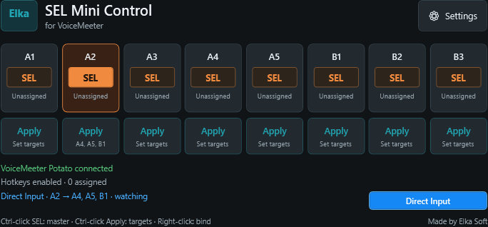
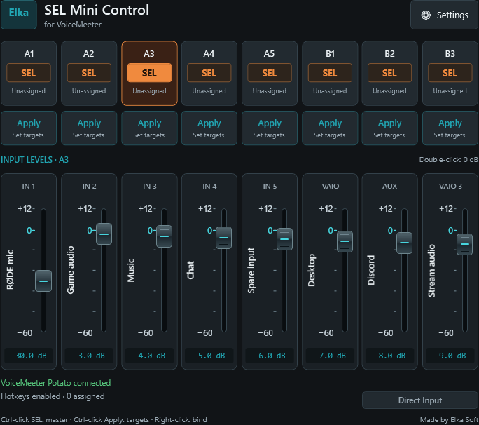
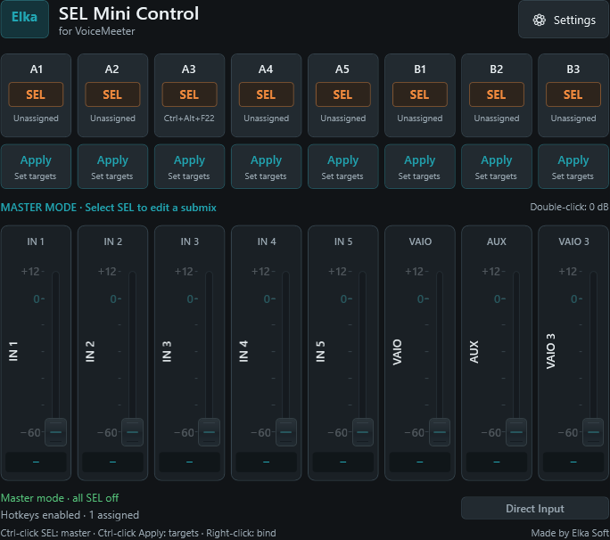

# Elka SEL Mini Control

**for VoiceMeeter**

A compact Windows desktop control for VoiceMeeter Potato, made by **Elka Soft**.
Two rows of eight buttons: orange SEL buttons above individual Apply buttons.
Bidirectional synchronization, optional named input faders, Direct Input linking,
saved per-bus destinations, global hotkeys, MIDI learn and incoming VBAN Text.
Uses the dark charcoal and teal palette from the existing
Elka VoiceMeeter FX Host app. No installer or separate API download.

Includes an Elka-style submix icon and a dark system-tray menu.

## Two views

**Compact mode** keeps the eight SEL buttons and their individual Apply buttons
in a small window. Direct Input sits below Apply B2/B3.



**Fader mode** extends the window downward. Its eight faders show the selected
SEL's input mix, with VoiceMeeter channel names, readable +12 / 0 / −60 marks,
and live dB readouts. Enable it in **Settings → Fader mode → Save**.



Screenshots are rendered from the app using example labels, levels and destinations.

## Controls at a glance

| Control | Function |
| --- | --- |
| SEL A1–A5 / B1–B3 | Choose the bus whose input submix you are editing. A normal mouse click keeps the active bus selected. |
| Ctrl-left-click active SEL | Turn all SELs off and enter master mode. Click a SEL normally to return. |
| Apply | Copy all eight input levels from that button's bus to its saved destinations. |
| Ctrl-click Apply | Choose that button's independent destination checklist. |
| Direct Input | Blue: mirror changed input levels to the selected SEL's checked destinations. Gray: off. |
| Fader mode | Show eight named input faders; edits and external changes synchronize both ways. |
| Right-click SEL / Apply | Assign a hotkey or learn a MIDI button, according to the input mode in Settings. |
| MIDI / hotkeys | Toggle SEL on/off or trigger Apply. No extra master-mode safety for these inputs in this release. |
| VBAN Text | Receive configurable network commands for SEL and Apply. |
| Tray Open / Exit | Restore the window or fully quit; startup and close-to-tray preferences are independent. |

## Open and run

For a portable build, download the ZIP from the
[dev prerelease](https://github.com/torment78/Elka-SEL-Mini-Control/releases/tag/v0.5.1),
extract the entire archive, and run **Elka.SEL.Mini.Control.exe**. The Windows x64
ZIP includes the .NET runtime. Close an older instance using its tray **Exit**
command first. Existing preferences are retained. No installer is included.

Dev releases increment the final version number: **0.5.0, 0.5.1, 0.5.2…**
They remain marked **Pre-release** on GitHub while there is no installer.

Only one copy runs in each Windows desktop session, even from different folders
or newer versions. Opening the app again restores the running copy from the tray
or a minimized window; it does not create another mixer connection. To switch
versions, choose **Exit** on the current copy first. A running older build is
detected during upgrade; if hidden, follow the prompt to use its tray menu.
Older releases cannot enforce the rule themselves, so avoid starting an old
executable after opening this version.

Open **Elka SEL Mini Control.sln** in Visual Studio 2022 with the **.NET desktop
development** workload and .NET 8 SDK. Set `Elka.SEL.Mini.Control` as the startup
project and press F5. The application targets Windows x64.

For a quick start, double-click **Run.cmd** in this folder. It builds and launches
the application. A Release executable is also produced at:

`src\Elka.SEL.Mini.Control\bin\Release\net8.0-windows\Elka.SEL.Mini.Control.exe`

The source build uses the .NET 8 Desktop Runtime. Keep its adjacent `.dll` and
`.json` files with it if you copy the build to another folder. VoiceMeeter Potato
must already be installed and running. This app automatically finds its installed
64-bit Remote API using the installation registry entry and standard VB folders;
it does not bundle or download the API, and has no API-path field.

## Startup and tray

Settings has three independent choices:

- **Start with Windows** launches the app when you sign in. Off by default.
- **Start in tray** starts with the window hidden, whether launched manually or
  by Windows. Off by default; this does not enable Windows startup.
- **Close to tray** makes the window's X hide it while the app keeps running.
  On by default. Turn this off if X should quit.

The notification icon is named **Elka SEL Mini Control**. Right-click it for a
dark **Open / Exit** menu, or left-click to open the window. **Exit always quits**,
releases the API, MIDI, hotkeys and VBAN port, and removes the tray icon.
If the icon is in Windows' overflow area, look under the taskbar's hidden-icons
arrow and drag it onto the taskbar if desired. Windows controls that placement.

SEL synchronization, MIDI, hotkeys and VBAN continue while hidden. A hidden
startup initializes these inputs without briefly showing the window. Windows
shutdown/sign-out is allowed to exit normally.

Windows startup uses this app's entry in the current user's
`Software\Microsoft\Windows\CurrentVersion\Run` registry key and needs no
administrator access. Save after enabling or disabling the option. Keep the app
in a permanent folder; after moving it, run it from the new folder and save
Settings again to update the executable path. Disabling removes only this app's
entry. Windows' own Startup Apps settings can also disable automatic launching.

## SEL and Apply

1. Click **A1–A5** or **B1–B3** to select that bus's SEL. Clicking the active button
   keeps it selected. **Ctrl-left-click the active SEL** to deliberately turn all
   SELs off and enter **master mode**. A normal click on any SEL returns to submix
   selection. Ctrl-click on an inactive SEL selects that bus.
2. Adjust the input submix in VoiceMeeter. Changes to SEL in VoiceMeeter are also
   reflected in this window, normally within 100 ms.
3. **Ctrl-left-click or Ctrl-right-click the Apply button beneath a bus** and
   tick its destination buses. Each of the eight Apply buttons saves its own
   independent checklist. Select all and Clear affect only that button's list.
4. Click that **Apply** button to copy its source bus's eight input levels to
   its saved destinations. For example, the Apply button beneath A2 always
   copies A2, regardless of the current SEL indicator. The app reads live levels
   when you press it and checks the destination levels after writing.

The source is excluded from its own destination list. Clicking an unconfigured
Apply button opens its checklist. Destination setup remains available when
VoiceMeeter is disconnected. Hover over Apply to see its full destination list
and input binding.

Apply copies `Strip[i].GainLayer[bus]` only. It does not copy input routing,
pan, mute, EQ, effects, bus master gain, or audio-device settings. No mixer
levels are written to VoiceMeeter on startup. Copying is rejected while disconnected,
without saved destinations, or while a change is pending.
An unconfirmed copy reports an error rather than success.

### SEL safety and master mode

The **mouse safeguard** keeps the active SEL selected when you click it normally.
Use **Ctrl-left-click on the active SEL** in this app to clear the selection.
Ctrl-click on an inactive SEL selects it. Right-click handles input bindings.

**MIDI and hotkeys keep their normal toggle behavior in this release.** Pressing
an assigned control for the active bus turns it off and can enter master mode;
the next press selects it again. No extra modifier or confirmation is required.
SEL changes from VoiceMeeter or other controllers are reflected as received,
including all-off states. MIDI/hotkey safety options are deferred to a later version.

On startup or reconnection, the app preserves an existing SEL. If none is
selected after the API has synchronized, it chooses **A1** initially or the
last selected bus during that session. It does not continually reselect a bus
after you turn SEL off with MIDI, a hotkey, or another controller.

**Master mode means every SEL is off.** The status area identifies it, and the
app's submix faders and Direct Input pause. VoiceMeeter's normal input fader can
then change levels across all bus submixes. Select a SEL before editing only one
bus's mix. The app does not intercept or guard VoiceMeeter's own controls.



## Direct Input

The **Direct Input** toggle sits beneath **Apply B2 and B3**, immediately above
the Elka Soft credit. It spans those two buttons and is half an Apply button
high: **bright blue means enabled**, and **gray means off**. The choice is saved;
it starts off for existing/new settings that do not contain this option.

1. Select a source SEL, either here or in VoiceMeeter.
2. Ctrl-click that source's Apply button and choose its destinations.
3. Enable Direct Input and move the source's input submix faders in VoiceMeeter.

For example, with **A2 SEL** active and **A4, A5 and B1** checked beneath A2,
moving A2's input 3 level sends that exact level to input 3 on A4, A5 and B1.
Each moved input follows independently. Unmoved input levels retain their current
values; use manual Apply to copy all eight at once.

The app checks approximately every 100 ms and sends only changed
`Strip[i].GainLayer[source]` values. It follows the currently selected bus's own
saved destination list, including SEL changes made directly in VoiceMeeter.
Routing, pan, mute, EQ and bus master levels are not linked. Destination changes
never feed back into the source. Operation continues while hidden in the tray.

Enabling the toggle, changing SEL/destinations, restarting or reconnecting
captures current levels without immediately copying them. Subsequent fader
changes are relayed. With no unique SEL or no saved targets, it waits. Manual
Apply, incoming VBAN command batches and settings/input-learning dialogs briefly
pause tracking; changes during that pause are not replayed afterward.

Keep the intended source SEL lit orange while editing a submix. Ctrl-clicking an
already active SEL enters master mode. With every SEL off, VoiceMeeter's normal input
fader can change all bus submixes independently of Direct Input. An empty Apply
list makes Direct Input send no copies; it does not restrict VoiceMeeter's own
fader behavior. Live mouse and MIDI testing confirmed that only the selected
bus changed with its Apply list empty.

Read/write errors or unconfirmed destination values pause Direct Input and show
an orange status message. Toggle it off and on after resolving the problem.
Turning it off stops new writes; commands already queued in the VoiceMeeter API
may finish. The existing manual Apply buttons remain available in either mode.

## Fader mode

Open **Settings**, turn on **Fader mode**, and click **Save**. The window extends
downward to show eight input faders beneath the button columns: IN 1–IN 5,
VAIO, AUX and VAIO 3. Turn the setting off to return to the compact window.

Each strip displays the input's current VoiceMeeter name vertically beside its
fader, with a live dB readout below. Blank names fall back to the input label.
Names and levels refresh automatically, including changes made outside this app.

Select one SEL to edit its submix. Switching SEL reads and displays that bus's
eight levels without copying the previous fader positions. Drag a fader, use
the arrow keys for 0.1 dB steps, or double-click to reset it to 0 dB. The range
is -60 to +12 dB. With Direct Input enabled, the selected source's checked Apply
destinations follow these edits in the same way as external fader changes.

Faders are disabled when there is no single selected SEL, while VoiceMeeter is
disconnected, or during a pending selection/Apply operation. A drag started on
one SEL cannot continue writing into a different SEL after a source switch;
release and start a new drag. Edits write only the selected input gain layer.
The fader-mode preference is saved; mixer levels and channel names stay in
VoiceMeeter. Fader mode starts off for existing settings.

## Hotkeys

Choose **Settings → Hotkeys**. **Right-click a button in either row** to assign
its shortcut. Ctrl-click on the SEL row is reserved for master mode; Ctrl-click
on the Apply row opens destinations. Press the key combination, then click **Save**. Use
**Clear** to remove a binding or **Cancel / Escape** to keep the current one.

Ctrl, Alt, Shift and Win can be combined, including double, triple and quadruple
modifiers. Shortcuts work while another app is focused. Windows-reserved
shortcuts and combinations already registered by another program are reported
as unavailable. Key repeat does not repeatedly toggle SEL. All shortcuts start
unassigned; assigning a shortcut does not press SEL.
Pressing an assigned SEL hotkey toggles that bus on/off, including hotkeys with
Ctrl in the combination. The mouse Ctrl-click safeguard does not apply to hotkeys.

## MIDI

Choose **Settings → MIDI input**, select a device, and save. **Right-click the
SEL or Apply button** you want to control to open **Learn MIDI**. Press the physical MIDI
button, then click **Save**. Learning does not activate the button.

Supported messages are **Note On/Off** and **Control Change**, on channels 1–16.
Use a momentary controller button: a nonzero value is a press, and note-off or
zero is a release. Holding a button triggers once; releasing rearms it. A MIDI
message can be assigned to only one button. Program Change, pitch bend, clock and
SysEx messages are ignored. If a MIDI device is removed, refresh and reselect it
in Settings. A device held exclusively by another program may not open.

Hotkeys and MIDI are selectable input modes; mouse control always remains
available. Both sets of assignments are kept when switching modes.
An assigned SEL MIDI button toggles its bus on/off without the mouse safeguard.

## Incoming VBAN Text

Open **Settings → VBAN Text…**, enable the receiver and configure its network
fields. Click **Use settings**, then **Save** in the main Settings window.
VBAN works alongside the selected hotkey/MIDI mode.

Every network field is editable and saved:

| Field | Initial value | Purpose |
| --- | --- | --- |
| Listen IP | `127.0.0.1` | Local interface to bind; use `0.0.0.0` for all interfaces or this PC's LAN IPv4 address. |
| UDP port | `6982` | Port the sender must target. Choose any available port from 1–65535. |
| Stream name | `Command1` | Must match the sender's VBAN stream name exactly; 1–16 ASCII characters. |
| Allowed sender IPv4 | Blank | Optional incoming IP filter; blank accepts any sender that can reach the listener. |

These are starting values, not fixed receiver settings. The receiver is initially
disabled. Port 6982 avoids the FX Host's default 6981; choose a different value
if another application uses it. For another computer, send to this PC's LAN IP
and allow this app's configured UDP port through Windows Firewall if required.

VBAN presses either row by bus name; destinations are configured **in the app**:

```text
VMC.SEL(A1);
VMC.SEL(A1)=1;
VMC.SEL.Apply(A1);
VMC.SEL.Apply(A2);
VMC.SEL.Apply[B3];
```

- `VMC.SEL(A1);`, `=1`, `=On`, and `=Toggle` select A1 and keep it selected.
- `=0` / `=Off` on an active bus are rejected with guidance to Ctrl-click its
  SEL in the app. Off on an inactive bus does nothing. Remote commands cannot
  enter master mode in this release; MIDI/hotkeys have separate toggle behavior.
- `VMC.SEL.Apply(A2);` presses A2's bottom-row Apply button, copying **A2's**
  live levels to **A2's saved destinations**. No routing list belongs in the
  incoming command. It does not change which SEL is active.
- Both matching parentheses and square brackets work. An extra dot before the
  brackets is also accepted, for example `VMC.SEL.(A1);`.
- Multiple commands can share one packet, separated with semicolons. For example:
  `VMC.SEL(A2)=1;VMC.SEL.Apply(A2);`. Selection is confirmed before Apply runs.

For VoiceMeeter MacroButtons, configure an outgoing VBAN Text slot with the
same destination port and stream name, then use:

```text
SendText("vban1", VMC.SEL(A2););
SendText("vban1", VMC.SEL.Apply(A2););
```

Use press actions for SEL and Apply; leave release actions empty. The app
receives standard VBAN Text packets (ASCII, UTF-8 or UTF-16LE, text channel 0),
not raw UDP strings. The status line reports receiver errors and the last accepted
command. Wrong streams, disallowed sender IPs, unknown commands, and malformed
packets are ignored. Duplicate/out-of-order frames from the same sender are
ignored during an active stream; two seconds of inactivity allows a restarted
sender's counter to begin again. Commands are ignored while a settings or input
learning dialog is open. VBAN Text carries commands only; this app does not
receive or route VBAN audio.

## Saved preferences

Input mode, MIDI device, bindings for both rows, eight destination profiles,
startup/tray preferences, Fader mode, Direct Input mode and all VBAN receiver fields are saved
to `%LOCALAPPDATA%\ElkaSoft\ElkaSELMiniControl\settings.json`. Mixer levels are
always read from VoiceMeeter rather than saved by this app.
The original eight SEL bindings are retained on upgrade. The former single
destination checklist is migrated to each Apply profile, excluding its own source.

Upgrading from **Elka VM Mini Control** automatically imports your previous
settings if the new settings file does not exist. The old file in
`%LOCALAPPDATA%\ElkaSoft\ElkaVMMiniControl` is retained as a backup. An existing
Windows startup entry is moved to the new app name and executable on first launch;
startup stays off if you never enabled it. Single-instance protection is shared
with version 0.5.0 under the previous name.

The incoming **`VMC.SEL(...)`** and **`VMC.SEL.Apply(...)`** commands remain the
same so existing VBAN senders keep working.

## Verification

```powershell
dotnet build "Elka SEL Mini Control.sln" -c Release
dotnet run --project tests/Elka.SEL.Mini.Control.Checks -c Release -- artifacts/checks
```

The dependency-free checks cover copying and error paths, external SEL changes,
disconnect/reconnect, MIDI presses/releases, binding persistence, Windows global
hotkey registration/conflicts, per-button profile isolation, settings migration,
and WPF controls. VBAN tests send actual loopback UDP packets using a custom
IP, port and stream into a simulated mixer, checking command order and filtering.
Tray checks cover hidden startup, background SEL/hotkey/VBAN operation, restoring
the window, close/exit behavior, and resource release. Startup registration checks
use an isolated temporary registry key; they do not enable Windows startup.
Direct Input checks cover independent moved inputs, source/profile switching,
rapid fader moves and delayed readback, feedback prevention, disconnects, error
pausing, saved mode and hidden-window operation. Mixer writes in these checks
use a simulated API; the live probe below remains read-only.
Fader checks cover input names, external updates, source changes during a drag,
gain limits, queued readback and settings persistence. SEL checks cover protected
mouse clicks, Ctrl-click master mode, unguarded MIDI/hotkey toggles, external
selection changes and startup/reconnect behavior.
Single-instance checks use isolated names and child processes to verify duplicate
launches, activation during startup, tray restoration and recovery after exit/crash.
The checks render the main window, settings, hotkey, MIDI and VBAN dialogs into
`artifacts/checks`.

Optional **read-only** verification of your installed API:

```powershell
dotnet run --project tests/Elka.SEL.Mini.Control.Checks -c Release -- --live-probe
```

This lists live SEL, input labels and gain-layer values plus MIDI device names, without
writing mixer parameters. A physical controller and real keyboard presses
should also be tried with your chosen bindings.

## API references

- [VB-Audio Remote API documentation](https://download.vb-audio.com/Download_CABLE/VoicemeeterRemoteAPI.pdf)
- [Windows RegisterHotKey](https://learn.microsoft.com/en-us/windows/win32/api/winuser/nf-winuser-registerhotkey)
- [Windows MIDI input](https://learn.microsoft.com/en-us/windows/win32/api/mmeapi/nf-mmeapi-midiinopen)
- [VB-Audio VBAN protocol specification](https://vb-audio.com/Voicemeeter/VBANProtocol_Specifications.pdf)
- [Windows notification icons](https://learn.microsoft.com/en-us/dotnet/api/system.windows.forms.notifyicon)
- [Windows startup registry entries](https://learn.microsoft.com/en-us/windows/win32/setupapi/run-and-runonce-registry-keys)

The API session logs in once and survives VoiceMeeter restarts, then logs out on
exit. The app uses `Bus[i].Sel` for submix selection; `Bus[i].Monitor` controls a
different monitoring function and is not changed.
