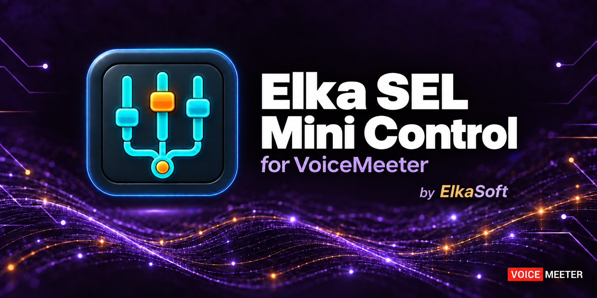
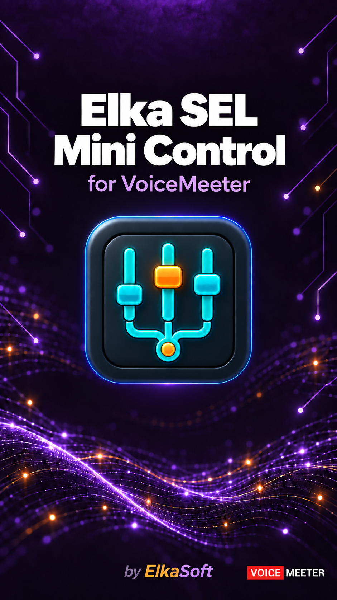
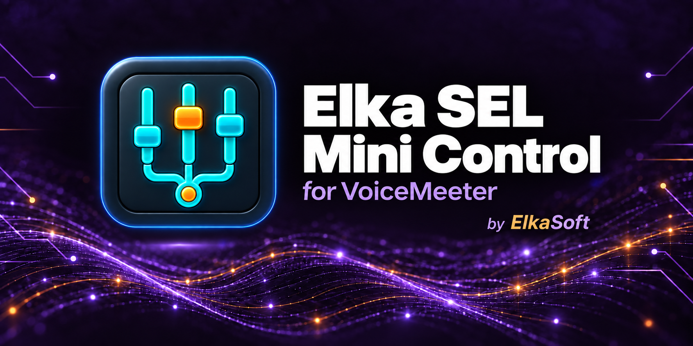
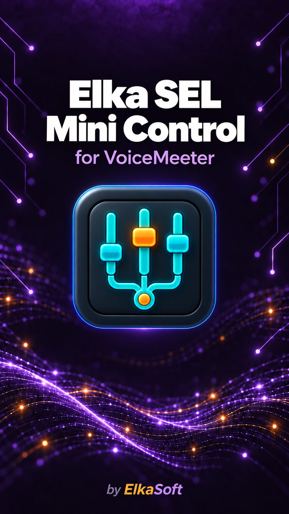

# Elka SEL Mini Control — banner options

Violet and amber wave design, with the existing teal/orange app icon.

All five image files are together in this folder. The two marked versions add only the **VOICE MEETER** corner mark, without a VBAN or technology caption.

| File | Variant | Dimensions | File size |
| --- | --- | --- | --- |
| [horizontal.png](horizontal.png) | Original horizontal | 1774 × 887 | 1,672,545 bytes |
| [vertical.png](vertical.png) | Original vertical | 941 × 1672 | 1,636,783 bytes |
| [horizontal-voicemeeter.png](horizontal-voicemeeter.png) | Horizontal with corner mark | 1774 × 887 | 1,684,141 bytes |
| [vertical-voicemeeter.png](vertical-voicemeeter.png) | Vertical with corner mark | 941 × 1672 | 1,640,946 bytes |
| [horizontal-voicemeeter-under-1mb.jpg](horizontal-voicemeeter-under-1mb.jpg) | Horizontal with corner mark, under 1 MB | 1774 × 887 | **492,572 bytes** |

The JPEG retains the PNG's full dimensions and uses quality 98. It is below both 1,000,000 bytes and 1 MiB.

## Horizontal with VoiceMeeter

## Vertical with VoiceMeeter

## Originals

Artwork created and edited with the built-in image-generation tool. The original banners are preserved as supplied. See [PROMPTS.md](PROMPTS.md) for the generation and edit prompts.
